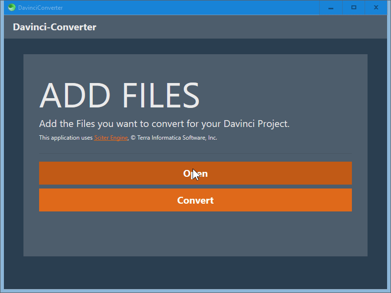

# DavinciLinuxConverter

Exactly the same as [this](https://github.com/valplusplusle/DavinciLinuxConverter), except cloned using [Sciter](https://sciter.com/) instead of Electron.

## Preview

## Instructions

On Windows, download [scapp.exe](https://github.com/c-smile/sciter-sdk/blob/master/bin.win/x32/scapp.exe), place it inside this folder, and run it.

**FFMPEG must already be installed and in your computer's `PATH` environment variable.**

The corresponding binaries for Mac and Linux can be found in `bin.osx` and `bin.lnx`, respectively.

